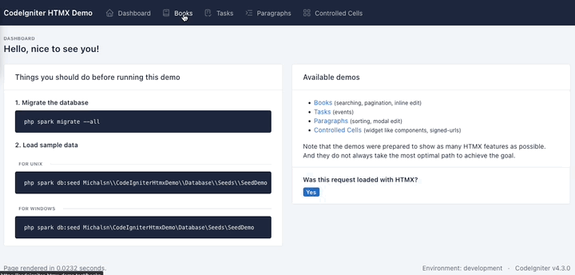

# CodeIgniter HTMX Demo

This is a demo for [CodeIgniter HTMX](https://github.com/michalsn/codeigniter-htmx) helper library. Demo requires:

- CodeIgniter HTMX library installed via composer or manually,
- CodeIgniter 4.3 or later version.



#### Available demos:

- **Books** - searching, pagination, inline edit
- **Tasks** - events
- **Paragraphs** - sorting, modal edit
- **Controlled Cells** - widget like components, signed-urls (the last one requires [CodeIgniter Signed-URL](https://github.com/michalsn/codeigniter-signed-url) library)

## Installation

1. Install [CodeIgniter 4](https://codeigniter.com/) with composer (command below) or [manually](https://codeigniter.com/user_guide/installation/installing_manual.html). 
```console
composer create-project codeigniter4/appstarter codeigniterhtmx
cd codeigniterhtmx
```
2. Install [CodeIgniter HTMX](https://github.com/michalsn/codeigniter-htmx) library with composer (command below) or [manually](https://michalsn.github.io/codeigniter-htmx/installation/#manual-installation).
```console
composer require michalsn/codeigniter-htmx
```
3. Manually download ZIP file of this project and place it in the desired folder. 

   - The example will assume that it will be `codeigniterhtmx/app/ThirdParty/htmx-demo`. 
   - Then enable it by editing the `codeigniterhtmx/app/Config/Autoload.php` file and adding the `Michalsn\CodeIgniterHtmxDemo` namespace to the `$psr4` array, like in the below example:

```php
<?php

// ...

public $psr4 = [
    APP_NAMESPACE => APPPATH, // For custom app namespace
    'Config'      => APPPATH . 'Config',
    'Michalsn\CodeIgniterHtmxDemo' => APPPATH . 'ThirdParty/htmx-demo/src',
];

// ...
```

## Database

First, make sure to create a database for the project. You can name it `codeigniterhtmx` and set credentials for the database connection in `codeigniterhtmx/app/Config/Database.php`, see [framework's user guide](https://codeigniter.com/user_guide/database/configuration.html) for more information.

Before running the examples you have to migrate the database. Make sure you have set correct credentials to the database and then run the command:
```console
php spark migrate --all
```

And preferably run the seeds:

**For Unix:**
```console
php spark db:seed Michalsn\\CodeIgniterHtmxDemo\\Database\\Seeds\\SeedDemo
```

**For Windows:**
```console
php spark db:seed Michalsn\CodeIgniterHtmxDemo\Database\Seeds\SeedDemo
```

## Running the demo

The default route to the demo page is `demo`.